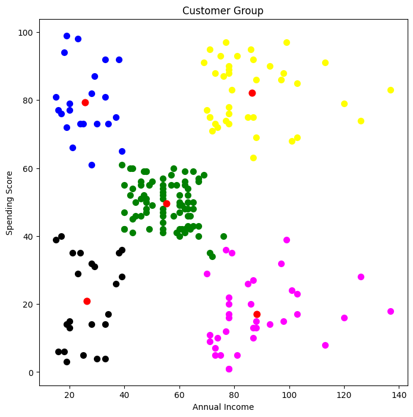

# Customer Segmentation using K-Means Clustering

This project uses **K-Means Clustering** to group customers based on **Annual Income** and **Spending Score**.  
The goal is to help businesses understand customer behavior and design targeted marketing strategies.

##Dataset
- Customer data with features like Gender, Age, Annual Income, and Spending Score.
- Analysis focuses on **Annual Income** and **Spending Score**.

##Steps in the Project
1. **Data Exploration** – Checked data shape, missing values, and structure.
2. **Feature Selection** – Chose Annual Income & Spending Score for clustering.
3. **Finding Optimal Clusters** – Used the Elbow Method to find the ideal number of clusters.
4. **Applying K-Means** – Created 5 customer groups.
5. **Visualization** – Plotted clusters with different colors and marked centroids.

##Results
Five customer segments were identified:

- **Cluster 1 (Green)** – Average income & spending; consistent buyers.  
- **Cluster 2 (Yellow)** – High income & high spending; premium customers.  
- **Cluster 3 (Blue)** – Low income & high spending; brand-conscious buyers.  
- **Cluster 4 (Black)** – Low income & low spending; budget-conscious customers.  
- **Cluster 5 (Magenta)** – High income & low spending; potential premium buyers.

##Business Impact
This segmentation allows:
- Premium offers for high spenders
- Loyalty rewards for regular buyers
- Promotions for conservative spenders

##Technologies Used
- Python
- Pandas, NumPy
- Matplotlib, Seaborn
- scikit-learn

## 📷 Visualization

**Author:** Tharunadhithya 
**Date:** August 2025
